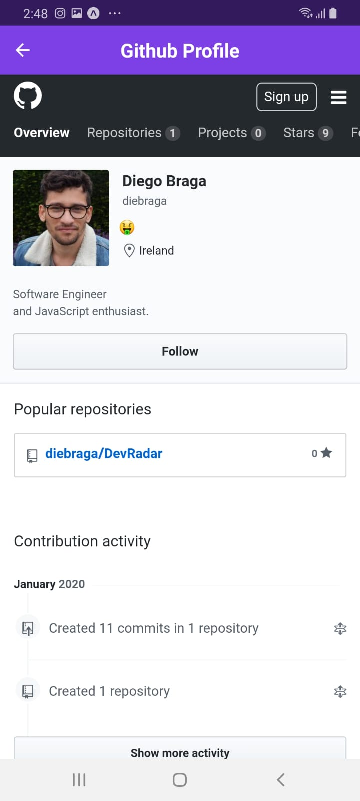
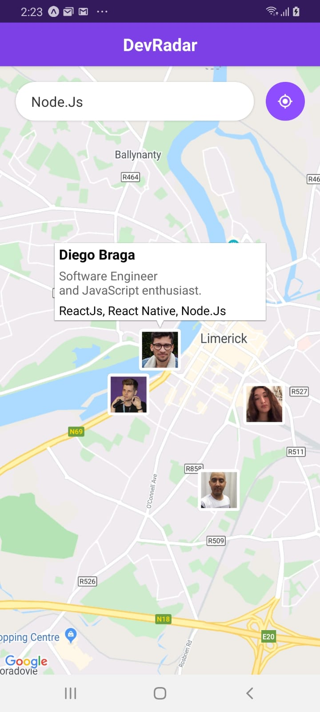

<h1 align="center">DevRadar</h1>

<strong>DevRadar</strong> Omnistack 10.0 <a href="https://rocketseat.com.br">Rocketseat</a>

## Techs 🚀
#### Node.js
#### React
#### React Native/ Expo

## How it works

1. Clone the project in your local repository
2. `yarn start` will star the api, the same comand will open the web application.
3. `expo start` will start the mobile app.

## Details

#### The app will find developers around based on the techs typed on the mobile app limit 10km.
#### The web app is capable to register new users only.

  
